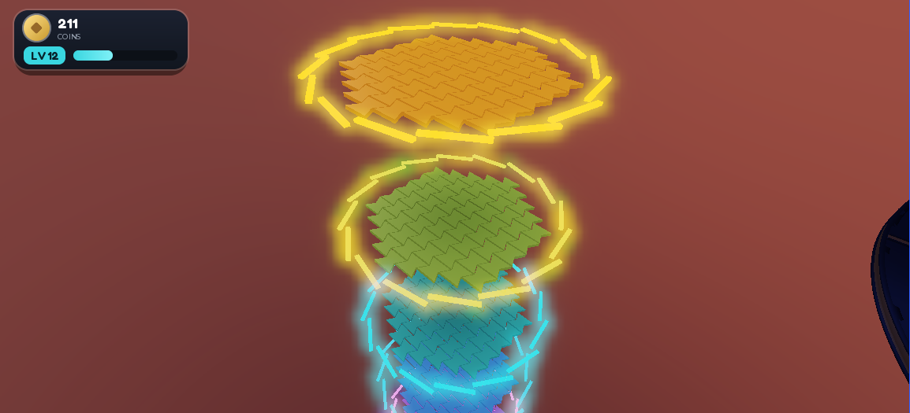
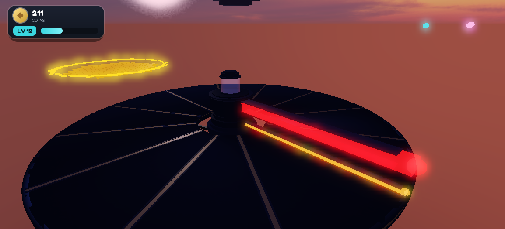
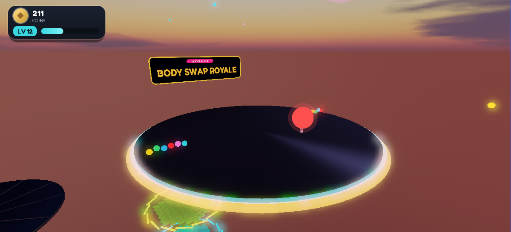
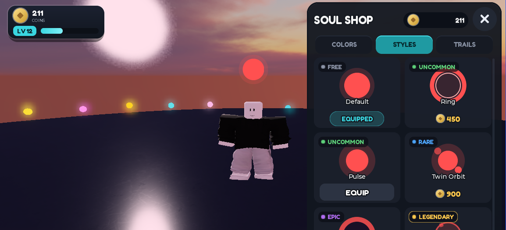

# Body Swap Royale

**A Roblox party-elimination game where you keep losing your body.**

Players are periodically reshuffled into each other's avatars on a shrinking
arena. The body you are standing in right now is not yours, it will not be yours
in thirty seconds, and the last surviving body wins the round.

[](https://github.com/mkepg/body-swap-royale/actions/workflows/ci.yml)


🎮 **[Play it on Roblox →](https://www.roblox.com/games/126417156496497/Body-Swap-Royale)**



---

## The game

Two arenas rotate between rounds, and the swap timing is deliberately
unpredictable — the cadence tightens as the population thins, so the last few
players get reshuffled fastest.

| | |
|:--:|:--:|
|  |  |
| **Soul Sweeper** — a rotating turbine arm sweeps the disc; jump or get launched. | **The lobby** — a broadcast-themed staging area between rounds. |
|  |  |
| **Soul Shop** — cosmetic halos, colors and trails across five rarity tiers. | **Hex-A-Gone** — hex tiles erode underfoot, dropping you a floor at a time. |

Your identity in this game is your **Soul** — a colored halo and trail that
travels with your *body*, not with your control. So when you get swapped into a
stranger's avatar, everyone can still see whose body you are wearing.

## How it's built

The interesting engineering problem is that **a body-swap game cannot use
Roblox's normal character model.** Three approaches were prototyped; the first
two were killed by evidence, not by theory.

1. **Server-authoritative input routing** — bodies stay server-owned, clients
   send intents. *Rejected:* with no client prediction, movement felt 0.3–0.6s
   delayed. Fatal for a game whose whole challenge is reacting to where a body
   is.
2. **Reassigning `Player.Character`** — gets prediction, camera and animation
   for free. *Rejected:* reassigning `Character` **synchronously destroys the
   previous body**, so a swap would shred the very bodies it was redistributing.
3. **Network-ownership transfer on persistent bodies** — *adopted.* Bodies are
   persistent models that are never anyone's `Character`. Control is granted by
   handing a client **network ownership** of a body, so that client simulates it
   locally (predicted, therefore smooth), and a swap is just a rotation of
   ownership. No destruction, no per-frame input routing, and server CPU drops
   because each client simulates only its own body.

That choice cascaded. Because bodies aren't `Character`s, **animations played on
them don't replicate at all** (confirmed: other clients saw zero tracks). Routing
animation through the server fixed visibility but made your own body animate a
full round-trip late. The adopted model makes animation a *pure local function
of replicated velocity*: every client animates every body itself, so no
animation data crosses the network and there is no animation state to desync.

The full decision record, including the rejected variants, is in the
[Technical Design Document](docs/body-swap-royale-tdd.md).

### Why this codebase is testable

Roblox code is notoriously hard to unit test. This project pushes game logic
into **`src/shared/` modules that never touch a Roblox API** — hex grid math,
erosion order, swap derangement, cadence curves, grace windows, XP curves, shop
catalog resolution. They take plain data and return plain data.

That is what makes the **33 Lune spec files** possible: they run in CI on a
Linux box with no Roblox engine anywhere. Anything genuinely requiring a live
DataModel — ownership transfer, physics, replication, DataStore persistence — is
covered instead by written [smoke-test procedures](docs/smoke-tests/), 21 of
them, each a repeatable manual script rather than a vague "check it works."

```
src/shared/     37 modules — pure logic + config, Rojo-mapped to ReplicatedStorage
src/server/     14 modules — round manager, swap controller, hazards, economy, persistence
src/client/     18 modules — HUD, input, camera, arena dressing, soul VFX
```

12,032 lines of Luau in `src/`, 3,293 lines of specs in `tests/`.

## How it's developed

This project is built on a
deliberately strict loop, and the artifacts are committed rather than thrown
away. Every feature slice gets:

1. A **design spec** in [`docs/specs/`](docs/specs/) —
   agreed before any code is written (36 of them).
2. An **implementation plan** in [`docs/plans/`](docs/plans/)
   — the ordered steps (36).
3. **Lune specs** for anything pure, written against the design.
4. A **smoke-test procedure** in [`docs/smoke-tests/`](docs/smoke-tests/) for the
   runtime behavior specs can't reach.

Studio itself is driven over the Roblox Studio MCP for inspection, screenshots
and in-session probing — the screenshots in this README were captured that way.

The point of committing the specs and plans is that the repo records *why* each
system looks the way it does. The architecture section above isn't reconstructed
after the fact; it's what the documents said at the time, including the parts
that turned out to be wrong.

## Quick start

You need [Rokit](https://github.com/rojo-rbx/rokit), Roblox Studio, and the Rojo
Studio plugin. Full instructions, including troubleshooting, live in
[`docs/dev-environment/getting-started.md`](docs/dev-environment/getting-started.md).

```bash
git clone https://github.com/mkepg/body-swap-royale.git && cd body-swap-royale
rokit install                                # pulls rojo 7.6.1 + lune 0.10.4
export PATH="$HOME/.rokit/bin:$PATH"         # persist in your shell rc
rojo plugin install                          # once per machine
rojo build -o body-swap-royale.rbxlx         # generate the place
rojo serve                                   # then Connect from the Rojo plugin in Studio
```

> Rounds need 2 players to start. For solo testing set `Config.SOLO_TEST_MODE = true`
> in [`src/shared/Config.luau`](src/shared/Config.luau) — note that swaps never
> fire with one player, since the derangement needs at least two.

## Tests

```bash
bash scripts/test.sh          # run all 33 specs
bash scripts/test.sh hex      # only specs matching "hex"
```

The same command runs in [CI](.github/workflows/ci.yml) on every push and pull
request.

## Project layout

```
src/{client,server,shared}    Luau source — Rojo-mapped per default.project.json
tests/                        Lune spec files for shared/pure modules
docs/                         GDD, TDD, dev environment, specs, plans, smoke tests
docs/README.md                Documentation index — start here
scripts/test.sh               Lune spec runner
rokit.toml                    Pinned tool versions
```

## Documentation

[**docs/README.md**](docs/README.md) indexes everything. The highlights:

- [Game Design Document](docs/body-swap-royale-gdd.md) — gameplay, UX, economy, progression
- [Technical Design Document](docs/body-swap-royale-tdd.md) — architecture, networking, anti-cheat
- [Critical review](docs/reviews/2026-07-03-critical-review.md) — an honest pass over the weak points
- [CHANGELOG.md](CHANGELOG.md) — the full build history

## Status

Pre-alpha and playable. Two arenas, the swap system, the Soul cosmetics shop,
and the lobby all work end to end; balance and content are still moving. Built
and maintained by one developer.

## License

Source-available, **all rights reserved** — see [LICENSE](LICENSE). You're very
welcome to read, study, and run this code to evaluate it. You may not
redistribute it or ship it as your own experience.
